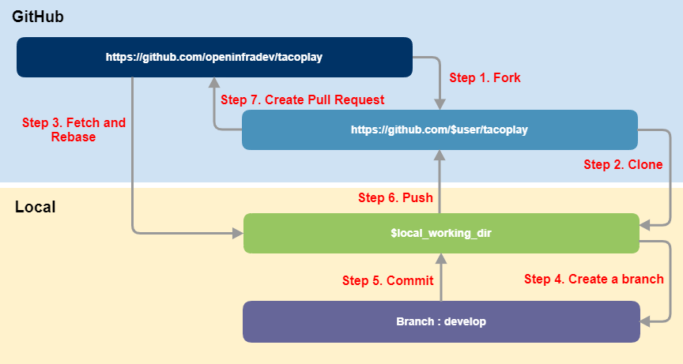

# GitHub Workflow

HANU Community는 GitHub Workflow에 따라 기여를 제출하고 검토 및 Merge합니다. 



여기서는 HANU Community의 대표적인 Project인 tacoplay를 예시로 GitHub Workflow를 설명합니다. 

- [GitHub Workflow](#github-workflow)
  - [GitHub Workflow example](#github-workflow-example)
    - [Step 1. Fork](#step-1-fork)
    - [Step 2. Clone](#step-2-clone)
    - [Step 3. Fetch / Rebase](#step-3-fetch--rebase)
    - [Step 4. Create a branch](#step-4-create-a-branch)
    - [Step 5. Commit](#step-5-commit)
    - [Step 6. Push](#step-6-push)
    - [Step 7. Create a Pull Request](#step-7-create-a-pull-request)
  - [Code Review](#code-review)
  - [Merge](#merge)
  - [Revert Commit](#revert-commit)

## GitHub Workflow example

### Step 1. Fork 

1. GitHub에 본인 계정으로 로그인 후 https://github.com/openinfradev/tacoplay 를 방문하세요.
2. 우측 상단의 `Fork` 버튼을 클릭해서 tacoplay를 본인 계정으로 Fork 하세요. 

### Step 2. Clone

Fork한 본인 계정의 Repository를 Local로 Clone 하고, upstream repository를 추가하세요. 

```
mkdir -p $working_dir
cd $working_dir
git clone https://github.com/$user/tacoplay.git

cd $working_dir/tacoplay
git remote add upstream https://github.com/openinfradev/tacoplay.git

# Never push to upstream main
git remote set-url --push upstream no_push

# Confirm that your remotes make sense:
git remote -v
```

### Step 3. Fetch / Rebase

(Clone후 시간이 지난 시점이라면) main branch를 최신 상태로 유지합니다. 

fetch를 수행하고, upstream에 변경 사항이 있을 경우 경우 rebase하여 main branch를 최신 상태로 유지합니다.

```
cd $working_dir/tacoplay
git fetch upstream
git checkout main
git rebase upstream/main
```

fetch/rebase 대신 pull을 사용하지 마세요. git pull은 merge를 수행하면서 comit history를 지저분해지게 할 수 있기 때문입니다.  


### Step 4. Create a branch

이 상태에서 myfeature branch를 생성합니다. 

```
git checkout -b myfeature
```

myfeature branch에서 코드 수정 작업을 합니다. 


### Step 5. Commit

수정 사항을 commit 하세요. commit message는 가능한 자세히 작성합니다. 

```
git add --all
git commit
```

### Step 6. Push

생성한 commit을 origin에 push하세요.

```
git push -f ${your_remote_name} myfeature
```

### Step 7. Create a Pull Request 

1. GitHub에 로그인해서 본인 계정의 Fork한 repository로 갑니다. : https://github.com/$user/tacoplay
2. `myfeature` branch 옆의 `Compare & Pull Request` 버튼을 클릭하세요. 
3. Pull Request하여 수정 사항의 리뷰를 요청합니다. Pull Request에 관련한 세부 사항은 다음 안내를 참고하세요. : [Pull Request](pull-requests.md)

## Code Review

Pull Request가 Open되면 한명 이상의 Reviewer에게 할당 됩니다. Reviewer는 수정 사항에 대해 Coding Style부터 버그 유무 등 Review를 수행하여 merge 여부를 결정합니다. 

Review 결과 수정이 필요한 사항은 `myfeature` branch 상에서 수행합니다. 

## Merge

Reviewer와 Approval의 승인을 받으면 자동으로 merge가 진행됩니다. 

## Revert Commit

Commit을 revert하고자 할때는 다음 안내를 따르세요. 

* Revert용 branch를 생성하고, upstream과 sync를 맞추세요. 
  
  ```
  # create a branch
  git checkout -b myrevert
  
  # sync the branch with upstream
  git fetch upstream
  git rebase upstream/main
  ```

* revert하고자 하는 commit이 
  * 복수의 commit일 경우
  ```
  # SHA is the hash of the merge commit you wish to revert
  git revert -m 1 SHA
  ```
  * 하나의 commit일 경우
  ```
  # SHA is the hash of the single commit you wish to revert
  git revert SHA
  ```
* 이 명령은 변경사항을 revert한 새로운 commit을 생성합니다. 이 commit을 push하세요. 
  ```
  git push ${your_remote_name} myrevert
  ```
* 이제 [Create a Pull Request](#step-7-create-a-pull-request) 합니다. 


---

HANU Community에서의 GitHub Workflow 과정에 문의나 의견이 있을 경우 [Issue](https://github.com/openinfradev/community/issues/new)를 생성해주세요. 